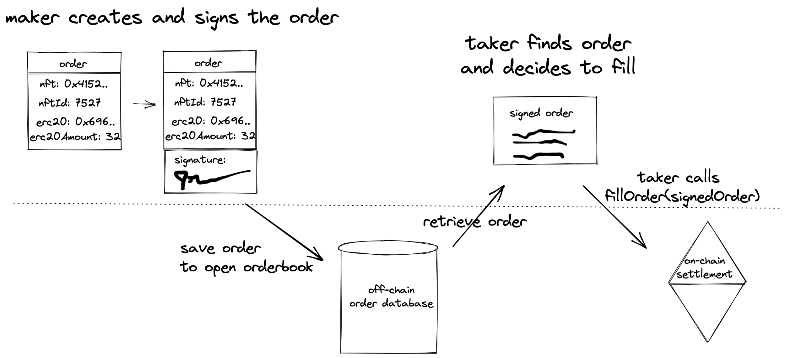

# Swap NFT <> ERC-20 Example

Let's swap a NFT (an [`ERC721`](https://eips.ethereum.org/EIPS/eip-721)) for USDC (an [`ERC20`](https://ethereum.org/en/developers/docs/standards/tokens/erc-20/)).


In this first example, we're going to do a 1:1 NFT swap. We're going to swap User A's CryptoPunk NFT for User B's Bored Ape NFT.

> **Terminology**: `maker`: Since User A will initiate the trade, we'll refer to User A as the `maker` of the trade.

> **Terminology**: `taker`: Since User B will be filling and completing the trade created by User A, we'll refer to User B as the `taker` of the trade.

```tsx
// Setup the sample data...
const CHAIN_ID = 1; // Chain 1 corresponds to Mainnet. Visit https://chainid.network/ for a complete list of chain ids

const CRYPTOPUNK_420 = {
  tokenAddress: '0xb47e3cd837ddf8e4c57f05d70ab865de6e193bbb', // CryptoPunk contract address
  tokenId: '420', // Token Id of the CryptoPunk we want to swap
  type: 'ERC721', // Must be one of 'ERC20', 'ERC721', or 'ERC1155'
};

const SIXTY_NINE_USDC = {
  tokenAddress: '0xA0b86991c6218b36c1d19D4a2e9Eb0cE3606eB48', // USDC contract address
  amount: '69000000', // 69 USDC (USDC is 6 digits)
  type: 'ERC20',
};

// User A Trade Data
const walletAddressUserA = '0x1eeD19957E0a81AED9a80f09a3CCEaD83Ea6D86b';
const nftToSwapUserA = CRYPTOPUNK_420;

// User B Trade Data
const walletAddressUserB = '0x44beA2b43600eE240AB6Cb90696048CeF32aBf1D';
const usdcToSwapUserB = SIXTY_NINE_USDC;

// ............................
// Part 1 of the trade -- User A (the 'maker') initiates an order
// ............................

// Initiate the SDK for User A.
// Pass the user's wallet signer (available via the user's wallet provider) to the Swap SDK
const nftSwapSdk = new NftSwap(provider, signerUserA, CHAIN_ID);

// Check if we need to approve the NFT for swapping
const approvalStatusForUserA = await nftSwapSdk.loadApprovalStatus(
  nftToSwapUserA,
  walletAddressUserA
);
// If we do need to approve User A's CryptoPunk for swapping, let's do that now
if (!approvalStatusForUserA.contractApproved) {
  const approvalTx = await nftSwapSdk.approveTokenOrNftByAsset(
    nftToSwapUserA,
    makerAddress
  );
  const approvalTxReceipt = await approvalTx.wait();
  console.log(
    `Approved ${assetsToSwapUserA[0].tokenAddress} contract to swap with 0x v4 (txHash: ${approvalTxReceipt.transactionHash})`
  );
}

// Create the order (Remember, User A initiates the trade, so User A creates the order)
const order = nftSwapSdk.buildOrder(
  nftToSwapUserA,
  usdcToSwapUserB,
  walletAddressUserA
);
// Sign the order (User A signs since they are initiating the trade)
const signedOrder = await nftSwapSdk.signOrder(order);
// Part 1 Complete. User A is now done. Now we send the `signedOrder` to User B to complete the trade.

// ............................
// Part 2 of the trade -- User B (the 'taker') accepts and fills order from User A and completes trade
// ............................
// Initiate the SDK for User B.
const nftSwapSdk = new NftSwap(provider, signerUserB, CHAIN_ID);

// Check if we need to approve the NFT for swapping
const approvalStatusForUserB = await nftSwapSdk.loadApprovalStatus(
  usdcToSwapUserB,
  walletAddressUserB
);
// If we do need to approve NFT for swapping, let's do that now
if (!approvalStatusForUserB.contractApproved) {
  const approvalTx = await nftSwapSdk.approveTokenOrNftByAsset(
    usdcToSwapUserB,
    walletAddressUserB
  );
  const approvalTxReceipt = await approvalTx.wait();
  console.log(
    `Approved ${assetsToSwapUserB[0].tokenAddress} contract to swap with 0x. TxHash: ${approvalTxReceipt.transactionHash})`
  );
}
// The final step is the taker (User B) submitting the order.
// The taker approves the trade transaction and it will be submitted on the blockchain for settlement.
// Once the transaction is confirmed, the trade will be settled and cannot be reversed.
const fillTx = await nftSwapSdk.fillSignedOrder(signedOrder);
const fillTxReceipt = await nftSwapSdk.awaitTransactionHash(fillTx);
console.log(`🎉 🥳 Order filled. TxHash: ${fillTxReceipt.transactionHash}`);
```


### Trade Lifecycle


