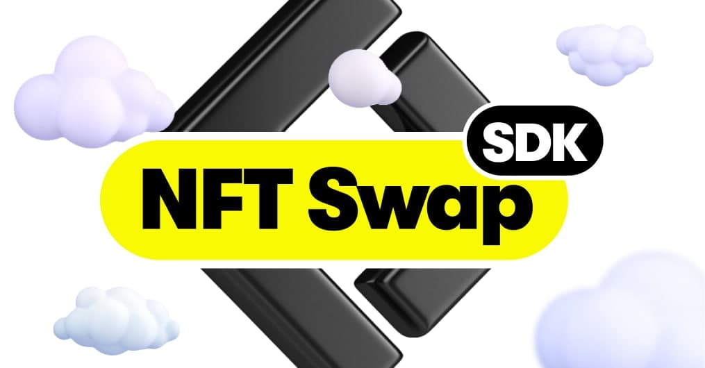

# Swap SDK

The missing peer-to-peer swap library for Ethereum and EVM-compatible chains, powered by the [0x protocol](https://0x.org), written in TypeScript for web3 developers. Trade tokens (ERC20s), NFTs, and other collectibles (ERC721 and ERC1155) with just a few lines of code. Seriously, easily trade anything on Ethereum with this library.

**🎉 Update 1/31/22: Swap SDK now supports 0x v4, check out the [docs](https://docs.swapsdk.xyz/0x-v4). 🎉**

## Overview

tl;dr: NFT Swap SDK is the easiest, most-powerful swap library available on the EVM. Supports Ethereum and EVM-compatible chains (Polygon, Avalanche, BSC, etc.). Works in both browser and Node.js. Written in TypeScript, built using the 0x protocol. With this library, you can build support for NFT marketplaces, over-the-counter (OTC) exchanges, and/or peer-to-peer exchanges.

The NFT Swap SDK developed by [Trader.xyz](https://trader.xyz) offers swap support for ERC20s, ERC721s, and ERC1155s. Exchange NFTs for NFTs, NFTs for ERC20 tokens, or bundles of NFTs and tokens. This library provides the ultimate swap flexibility combined with a simple API surface area so you can be productive immediately and focus on building your web3 app.

This library is powered and secured by the [0x v3 protocol](https://0x.org). The 0x v3 protocol has been in production for multiple years securing billions of dollars with of trades.

### Goals

We want to share all underlying technology trader.xyz uses with the community. While we won't be open-sourcing our frontend, as we think design and UX is our differentiator, we believe in open-sourcing and freely sharing all underlying technology.

Our end goal is every piece of tech you see trader.xyz use (protocol, swap libraries, open-source orderbook, order monitor, high-performance NFT indexer, property-based orders, specific React hooks, and NFT aggregation) end up open-source. This library is the first step to achieving our goal.

## Installation

You can install the SDK with yarn:

`yarn add @traderxyz/nft-swap-sdk`

or npm:

`npm install @traderxyz/nft-swap-sdk`

You can check out an example project [here](https://nft-swapping-demo.vercel.app/) 
or check out the example repo [here](https://github.com/HaidarEzio/NFTswap/tree/example-project)

## Configuration

To use the SDK, create a new NftSwap instance.

```tsx
import { NftSwap } from '@traderxyz/nft-swap-sdk';

// From your app, provide NftSwap the web3 provider, signer for the user's wallet, and the chain id.
const nftSwapSdk = new NftSwap(provider, signer, chainId);
```

Now you're set up and ready to use the SDK in your program. Check out the examples below to learn how to swap with the library.

## Examples

### Example 1: NFT <> NFT swap

In this first example, we're going to do a 1:1 NFT swap. We're going to swap User A's CryptoPunk NFT for User B's Bored Ape NFT.

> **Terminology**: `maker`: Since User A will initiate the trade, we'll refer to User A as the `maker` of the trade.

> **Terminology**: `taker`: Since User B will be filling and completing the trade created by User A, we'll refer to User B as the `taker` of the trade.

```tsx
// Setup the sample data...
const CHAIN_ID = 1; // Chain 1 corresponds to Mainnet. Visit https://chainid.network/ for a complete list of chain ids

const CRYPTOPUNK_420 = {
  tokenAddress: '0xb47e3cd837ddf8e4c57f05d70ab865de6e193bbb', // CryptoPunk contract address
  tokenId: '420', // Token Id of the CryptoPunk we want to swap
  type: 'ERC721', // Must be one of 'ERC20', 'ERC721', or 'ERC1155'
};

const BORED_APE_69 = {
  tokenAddress: '0xBC4CA0EdA7647A8aB7C2061c2E118A18a936f13D', // BAYC contract address
  tokenId: '69', // Token Id of the BoredApe we want to swap
  type: 'ERC721',
};

// User A Trade Data
const walletAddressUserA = '0x1eeD19957E0a81AED9a80f09a3CCEaD83Ea6D86b';
const assetsToSwapUserA = [CRYPTOPUNK_420];

// User B Trade Data
const walletAddressUserB = '0x44beA2b43600eE240AB6Cb90696048CeF32aBf1D';
const assetsToSwapUserB = [BORED_APE_69];

// ............................
// Part 1 of the trade -- User A (the 'maker') initiates an order
// ............................

// Initiate the SDK for User A.
// Pass the user's wallet signer (available via the user's wallet provider) to the Swap SDK
const nftSwapSdk = new NftSwap(provider, signerUserA, CHAIN_ID);

// Check if we need to approve the NFT for swapping
const approvalStatusForUserA = await nftSwapSdk.loadApprovalStatus(
  assetsToSwapUserA[0],
  walletAddressUserA
);
// If we do need to approve User A's CryptoPunk for swapping, let's do that now
if (!approvalStatusForUserA.contractApproved) {
  const approvalTx = await nftSwapSdk.approveTokenOrNftByAsset(
    assetsToSwapUserA[0],
    makerAddress
  );
  const approvalTxReceipt = await approvalTx.wait();
  console.log(
    `Approved ${assetsToSwapUserA[0].tokenAddress} contract to swap with 0x (txHash: ${approvalTxReceipt.transactionHash})`
  );
}

// Create the order (Remember, User A initiates the trade, so User A creates the order)
const order = nftSwapSdk.buildOrder(
  assetsToSwapUserA,
  assetsToSwapUserB,
  walletAddressUserA
);
// Sign the order (User A signs since they are initiating the trade)
const signedOrder = await nftSwapSdk.signOrder(order, makerAddress);
// Part 1 Complete. User A is now done. Now we send the `signedOrder` to User B to complete the trade.

// ............................
// Part 2 of the trade -- User B (the 'taker') accepts and fills order from User A and completes trade
// ............................
// Initiate the SDK for User B.
const nftSwapSdk = new NftSwap(provider, signerUserB, CHAIN_ID);

// Check if we need to approve the NFT for swapping
const approvalStatusForUserB = await nftSwapSdk.loadApprovalStatus(
  assetsToSwapUserB[0],
  walletAddressUserB
);
// If we do need to approve NFT for swapping, let's do that now
if (!approvalStatusForUserB.contractApproved) {
  const approvalTx = await nftSwapSdk.approveTokenOrNftByAsset(
    assetsToSwapUserB[0],
    walletAddressUserB
  );
  const approvalTxReceipt = await approvalTx.wait();
  console.log(
    `Approved ${assetsToSwapUserB[0].tokenAddress} contract to swap with 0x. TxHash: ${approvalTxReceipt.transactionHash})`
  );
}
// The final step is the taker (User B) submitting the order.
// The taker approves the trade transaction and it will be submitted on the blockchain for settlement.
// Once the transaction is confirmed, the trade will be settled and cannot be reversed.
const fillTx = await nftSwapSdk.fillSignedOrder(signedOrder);
const fillTxReceipt = await nftSwapSdk.awaitTransactionHash(fillTx.hash);
console.log(`🎉 🥳 Order filled. TxHash: ${fillTxReceipt.transactionHash}`);
```

### Example 2: Swap bundles -- Bundle of mixed ERC721s and ERC20 <> Bundle of ERC20s

Here we show an example of what the swap library is capable of. We can even swap arbitrary ERC tokens in bundles. We call it a bundle when we have more than one item that a party will swap. Bundles can have different ERC types within the same bundle.

In other words, we can swap `[ERC721, ERC1155, ERC20] <> [ERC721, ERC1155, ERC20]`. There's really no limit to what we can swap.

More concrete example: We can swap `[2 CryptoPunks and 1,000 DAI] for [420 WETH and 694,200 USDC]`. In this case we'd be swapping two `ERC721`s and an `ERC20` (Punk NFT and DAI, respectively) for `two ERC20s` (WETH and USDC).

This is just one example. In reality, you can swap as many things as you'd like, any way you'd like. The underlying 0x protocol is extremely flexible, and the NFT swap library abstracts all the complexity away so you don't have to worry about protocol nuances.

```tsx
// Set up the sample data for the swap...
const CHAIN_ID = 1; // Mainnet

const CRYPTOPUNK_420 = {
  tokenAddress: '0xb47e3cd837ddf8e4c57f05d70ab865de6e193bbb',
  tokenId: '420',
  type: 'ERC721',
};

const CRYPTOPUNK_421 = {
  tokenAddress: '0xb47e3cd837ddf8e4c57f05d70ab865de6e193bbb',
  tokenId: '421',
  type: 'ERC721',
};

const ONE_THOUSAND_DAI = {
  tokenAddress: '0x6b175474e89094c44da98b954eedeac495271d0f', // DAI contract address
  amount: '1000000000000000000000', // 1,000 DAI (DAI is 18 digits) -- amount to swap
  type: 'ERC20',
};

const SIXTY_NINE_USDC = {
  tokenAddress: '0xA0b86991c6218b36c1d19D4a2e9Eb0cE3606eB48', // USDC contract address
  amount: '69000000', // 69 USDC (USDC is 6 digits)
  type: 'ERC20',
};

const FOUR_THOUSAND_TWENTY_WETH = {
  tokenAddress: '0x6b175474e89094c44da98b954eedeac495271d0f', // WETH contract address
  amount: '420000000000000000000', // 420 Wrapped-ETH (WETH is 18 digits)
  type: 'ERC20',
};

// User A Trade Data
const walletAddressUserA = '0x1eeD19957E0a81AED9a80f09a3CCEaD83Ea6D86b';
const assetsToSwapUserA = [CRYPTOPUNK_420, CRYPTOPUNK_421, ONE_THOUSAND_DAI];

// User B Trade Data
const walletAddressUserB = '0x44beA2b43600eE240AB6Cb90696048CeF32aBf1D';
const assetsToSwapUserB = [SIXTY_NINE_USDC, FOUR_THOUSAND_TWENTY_WETH];

// ............................
// Part 1 of the trade -- User A (the 'maker') initiates an order
// ............................
const nftSwapSdk = new NftSwap(provider, signerUserA, CHAIN_ID);
// Note: For brevity, we assume all assets are approved for swap in this example.
// See previous example on how to approve an asset.

const order = nftSwapSdk.buildOrder(
  assetsToSwapUserA,
  assetsToSwapUserB,
  walletAddressUserA
);
const signedOrder = await nftSwapSdk.signOrder(order, makerAddress);

// ............................
// Part 2 of the trade -- User B (the 'taker') accepts and fills order from User A and completes trade
// ............................
const nftSwapSdk = new NftSwap(provider, signerUserB, CHAIN_ID);

const fillTx = await nftSwapSdk.fillSignedOrder(signedOrder);
const fillTxReceipt = await nftSwapSdk.awaitTransactionHash(fillTx);
console.log(`🎉 🥳 Order filled. TxHash: ${fillTxReceipt.transactionHash}`);

// Not so bad, right? We can arbitrarily add more assets to our swap without introducing additional complexity!
```

### Example 3: React Hooks + Swap SDK

In this example, we'll leverage the amazing [`web3-react`](https://github.com/NoahZinsmeister/web3-react) React Hook library.

```tsx
const App = () => {
  const { library, chainId } = useWeb3React<Web3React>();

  const [swapSdk, setSwapSdk] = useState(null);
  useEffect(() => {
    const sdk = new NftSwap(library, library.getSigner(), chainId);
    setSwapSdk(sdk);
  }, [library, chainId])

  // Use the SDK however you'd like in the app...
  const handleClick = useCallback(() => {
    if (!swapSdk) {
      return;
    }
    swapSdk.buildOrder(...)
  }, [swapSdk])

  // ...
}
```

## FAQ

- Which ERCs does this library support?

  - ERC20, ERC721, and ERC1155

- What EVM chains are currently supported?

  - Mainnet (1)
  - Kovan (42)
  - Rinkeby (4)
  - Polygon (137)
  - Binance Smart Chain (56)
  - Avalanche (43114)

- What protocol does this library use?

  - trader.xyz and trader.xyz libraries are powered by 0x v3 Protocol. This protocol is mature and lindy, and has been extremely well-audited.
  - Check out the 0x v3 spec [here](https://github.com/0xProject/0x-protocol-specification/blob/master/v3/v3-specification.md)
  - Check out the 0x v3 Consensys audit [here](https://consensys.net/diligence/audits/2019/09/0x-v3-exchange/)

- Are there any protocol fees to execute swaps?

  - No

- How do I get the user's `signer` object?

  - Generally you can get it from the user's web3 wallet provider, by something like this: `provider.getSigner()`.
  - See this [ethers guide](https://docs.ethers.io/v4/cookbook-providers.html#metamask) (control-f for `getSigner`).
  - In web3-react you can do:
    - `const { library } = useWeb3React();`
    - `const signer = library.getSigner();`

- How do I store a `SignedOrder`
  - That's up to you. This library has no opinions on how to store orders. You can throw them in a centralized SQL database, save them to localstorage, use a decentralized messaging solution -- it's really up to you and your app concerns. You can even serialize and compress an order to fit in a tweet or shareable URL! 🤯

## Support

For personalized help, please join the #dev-help channel in our Discord: https://discord.gg/RTvpQcxn4V

For general documentation, check out https://docs.swapsdk.xyz

## Roadmap

We're currently working on the following features for the next iteration of this library:

- ✅ LIVE -- Persistent data store of orders (off-the-shelf storage in trader.xyz's public order storage server). Think of it as a public good
- ✅ LIVE -- Property-based orders
- ✅ LIVE -- Order validation
- ✅ LIVE -- Live order status
- Order event streaming via WebSockets

If you have feature requests, reach out in our [Discord](https://discord.gg/GCf5rSX6).

We want to make this library a one-stop shop for all your NFT swapping needs.
